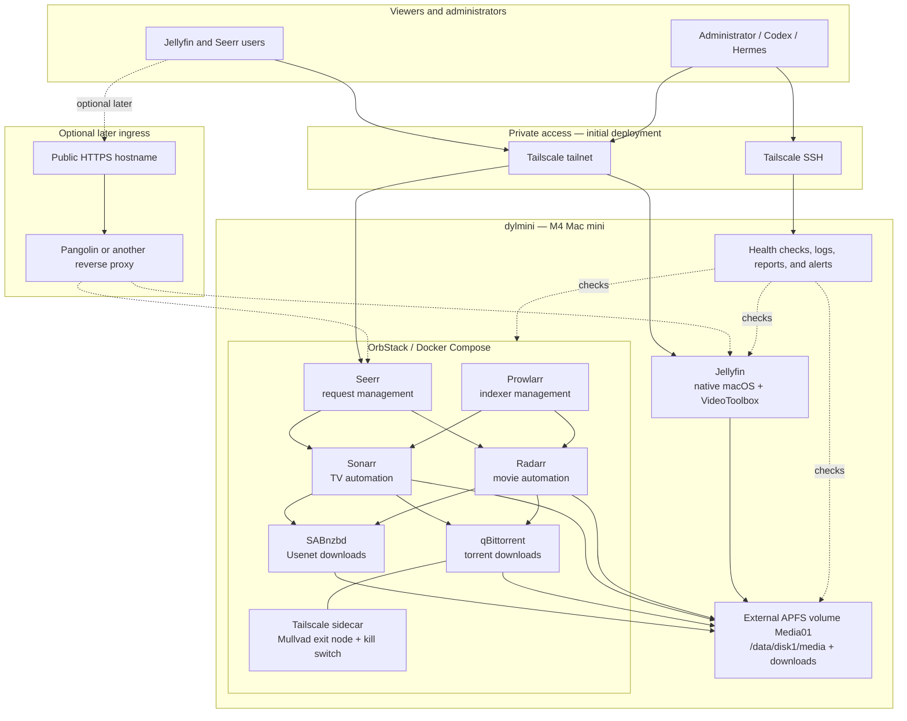

# Media server architecture

This document records the intended architecture for the media server on
`dylmini`. It is a design reference, not a claim that every component has
already been deployed.

## Repository layout

```text
homelab/
├── AGENTS.md                         # operating rules for administration agents
├── Brewfile                          # portable development and terminal tools
├── README.md
├── docs/
│   ├── media-server-architecture.md  # this document
│   └── runbooks/                     # setup, recovery, and incident procedures
├── dotfiles/                         # portable shell, Git, and editor configuration
├── hosts/
│   └── dylmini/
│       ├── Brewfile                  # native server packages and applications
│       ├── README.md
│       └── launchd/                  # host-specific agents and daemons
├── inventory/                        # hosts, storage, network, and service inventory
├── reports/
│   ├── current-state.md              # current agent handoff and known issues
│   └── history/                      # ignored generated health reports
├── scripts/                          # bootstrap, diagnostics, backup, and recovery
└── services/
    ├── README.md
    └── media/
        ├── README.md
        ├── compose.yaml              # planned container stack
        ├── .env.example              # names and locations, never real secrets
        └── config/                   # checked-in non-secret configuration
```

The repository contains definitions and documentation. Application databases,
download queues, logs, media, credentials, and other mutable state stay outside
Git.

## System architecture



## Media and download layout

The external APFS volume is intended to expose one consistent data tree to the
Mac and to every relevant container:

```text
/Volumes/Media01/data/
├── downloads/
│   ├── torrents/
│   │   ├── incomplete/
│   │   └── complete/
│   └── usenet/
│       ├── incomplete/
│       └── complete/
└── media/
    ├── movies/
    └── tv/
```

The Compose stack should mount `/Volumes/Media01/data` as `/data/disk1` rather
than giving each container unrelated host paths. Sonarr and Radarr then see the
same paths as the download clients:

```text
/data/disk1/downloads/torrents
/data/disk1/downloads/usenet
/data/disk1/media/movies
/data/disk1/media/tv
/data/disk1/media/anime
```

This avoids remote-path mappings and permits atomic moves or hard links when
the filesystem and client behavior allow them. Radarr and Sonarr own naming and
library organization; download clients only populate the download directories.

## Future storage expansion

Storage should grow through independent, disk-aware APFS volumes rather than an
opaque spanning pool. The first disk is named `Media01`; later disks follow the
same structure:

```text
/Volumes/Media01/data/
├── downloads/
└── media/
    ├── movies/
    ├── tv/
    └── anime/

/Volumes/Media02/data/
├── downloads/
└── media/
    ├── movies/
    ├── tv/
    └── anime/
```

Each volume is mounted separately in Compose:

```text
/Volumes/Media01/data  →  /data/disk1
/Volumes/Media02/data  →  /data/disk2
```

Sonarr and Radarr support multiple root folders, so each series or movie lives
entirely on one selected disk. Jellyfin can combine directories from multiple
disks into a single user-facing Movies, Shows, or Anime library. Tdarr can apply
the same policy to multiple physical libraries.

Downloads should normally land on the same filesystem as their intended media
root. Hard links cannot cross APFS volumes; a torrent downloaded on `Media01`
and imported to `Media02` requires a full copy while the original remains for
seeding. Disk-specific download categories or root selection can be introduced
when a second disk is added. Cross-volume copies are less problematic for
Usenet because completed downloads do not need to remain for seeding.

Content migrations should be initiated through Sonarr or Radarr by changing a
title's root folder, rather than moving managed files behind those applications.
Monitoring should verify each disk by APFS volume UUID as well as its friendly
name, free space, and mount path. A future NAS can be introduced as another
root without changing the user-facing Jellyfin libraries.

## Request and import flow

1. A user requests a title through Seerr.
2. Seerr submits it to the appropriate Sonarr or Radarr instance with an
   explicit root folder and quality profile.
3. Sonarr or Radarr queries indexers through Prowlarr and sends the selected
   release to qBittorrent or SABnzbd.
4. The download client writes into its section of `/data/disk1/downloads`.
5. Sonarr or Radarr validates, renames, and imports the result into
   `/data/disk1/media/tv`, `/data/disk1/media/anime`, or
   `/data/disk1/media/movies`.
6. Native Jellyfin detects or scans the imported file and exposes it to users.
7. Seerr synchronizes availability from Jellyfin and marks the request
   available.

One movie and one episode should be tested through this complete path before
the deployment is considered healthy.

## Networking and exposure

- The initial deployment is tailnet-only. Jellyfin, Seerr, and administrative
  interfaces should not require public router ports.
- Jellyfin runs natively so Apple VideoToolbox hardware transcoding is
  available. Display attachment is not required for VideoToolbox.
- qBittorrent shares the network namespace of a dedicated Tailscale sidecar
  using a Mullvad exit node. If the VPN path is unavailable, torrent traffic
  must fail closed. Its Web UI remains reachable from `dylmini` and the Servarr
  Compose network without exposing qBittorrent publicly.
- SABnzbd does not require the torrent VPN path. Its provider credentials and
  application database must persist outside the container image.
- A public proxy may be added later for televisions or users that cannot run
  Tailscale. Only Jellyfin and Seerr are candidates; Sonarr, Radarr, Prowlarr,
  SABnzbd, qBittorrent, SSH, and monitoring administration remain private.
- If Pangolin is used, streamed video traverses the VPS, so VPS bandwidth,
  monthly transfer, latency, and operational security must be evaluated first.

## State and secrets

Container state should use explicit bind mounts in a host state directory, for
example `/Users/dyma/Library/Application Support/Homelab/media/`, and must
survive container replacement and Compose restarts. The final location should
be recorded in `inventory/` before deployment.

Secrets are not committed. Interactive application credentials can initially
be entered through each application's Web UI and retained in its persistent
state. Machine credentials such as Tailscale auth keys should be retrieved from
Bitwarden or another designated secret store during provisioning; checked-in
`.env.example` files document only the required variable names.

## Operations and agent handoff

- Services emit logs locally.
- Routine health checks summarize current state into `reports/current-state.md`
  and ignored timestamped files under `reports/history/`.
- Hermes may handle routine checks, questions, and error-triggered notification.
- Codex handles larger configuration changes, diagnosis, and remediation using
  the repository and generated reports as shared context.
- Automatic remediation should begin with safe, bounded actions such as
  restarting a failed container. Storage, networking, media deletion, and
  access-control changes require explicit approval.
